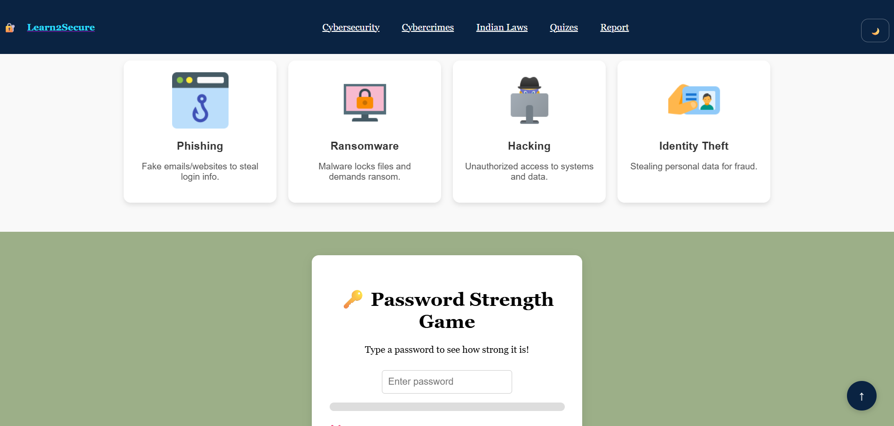
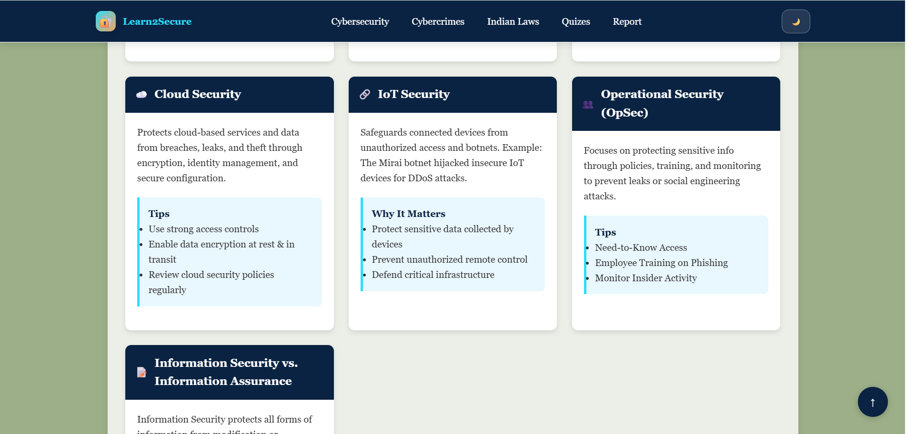
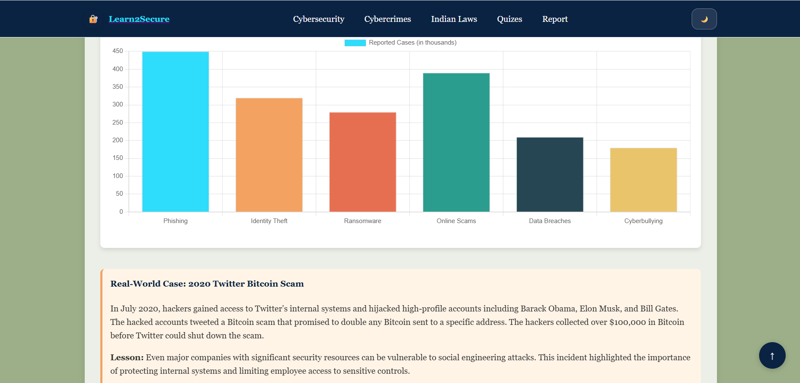
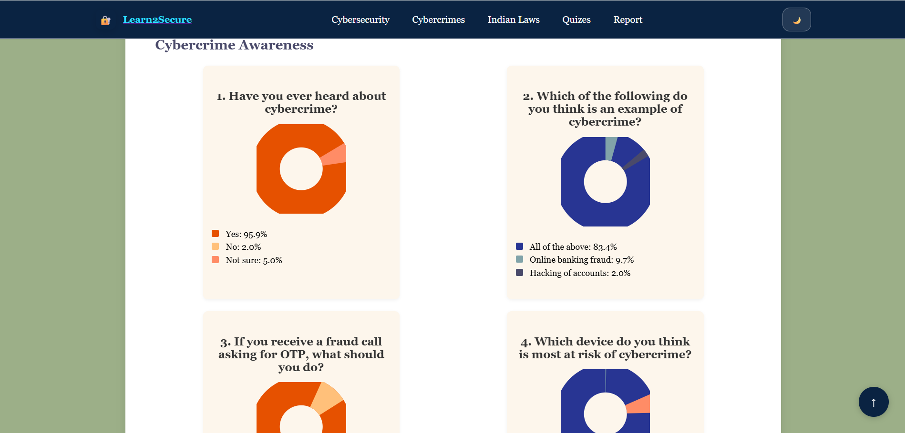
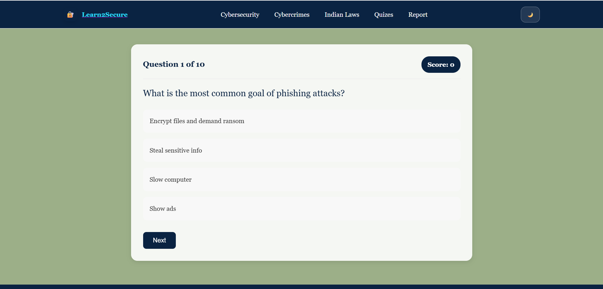
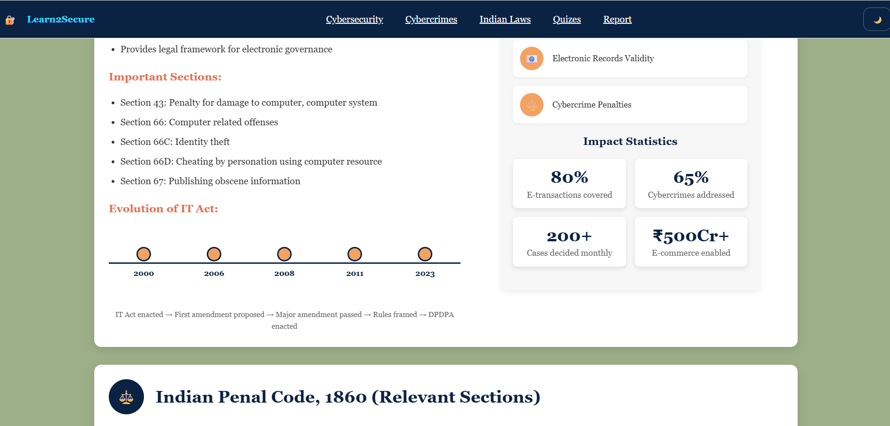

# Learn2Secure – Cyber Safety Educational Website

## About The Project

**Learn2Secure** is an educational website designed to spread awareness about cyber safety and online security.
The platform helps users understand cyber crimes, security practices, cyber laws, and provides interactive learning through quizzes and reporting guidance.

The project was developed to promote digital awareness while practicing frontend web development skills.

---

##  Features

* Cyber crime awareness section
* Cyber security learning resources
* Information about cyber laws
* Online incident reporting guidance
* Interactive quiz module
* User-friendly educational interface
* Responsive website design

---

## Technologies Used

* HTML5
* CSS3
* JavaScript

---

## Screenshots

### Homepage

### Cyber Security Section

### Cyber Crime Information

### Reporting Guide

### Quiz Section

### Cyber Laws Section

---

## Purpose of the Project

The goal of Learn2Secure is to educate users about safe internet practices and increase awareness regarding cyber threats and legal protections available online.

---

## Learning Outcomes

* Website structuring using HTML & CSS
* JavaScript interactivity implementation
* Educational UI design
* Organizing informational web content

---

## Author

Developed by **Yashfin Khan**
